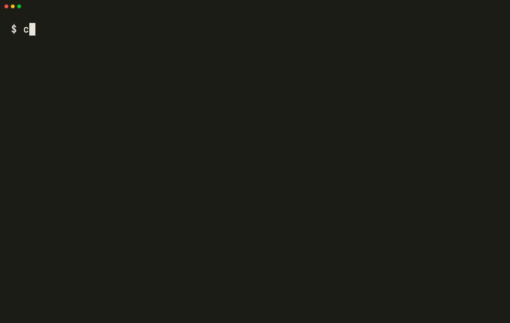

# Clew

*Clew is the thread through every meeting you attended. Pull it, and see what connects.*

Local-first meeting transcription and summarization CLI.
Record, transcribe, and summarize meetings and system audio entirely on your machine: no cloud, no bots, no data leaving your device.

[](https://github.com/ynaamane/clew/actions/workflows/ci.yml)
[](LICENSE.md)
[](https://www.python.org/downloads/)

<p align="center">
  
  <br>
</p>

## What it does

- **System audio capture**: native CoreAudio process tap (macOS 14.2+), no virtual audio drivers, no Screen Recording permission required
- **Microphone capture**: record system + mic simultaneously with `--mic`
- **WhisperX transcription**: fast, accurate speech-to-text with word-level timestamps
- **Speaker diarization and naming**: optional speaker identification via pyannote, with voice enrollment so real names replace generic `SPEAKER_00` labels
- **Local LLM summarization**: structured meeting notes with a built-in model (Phi-4-mini), or Ollama, LM Studio, or any OpenAI-compatible server
- **Ask your meetings**: natural-language questions across every past meeting, with quoted answers
- **Silence auto-stop**: stops recording after sustained silence (default 5 minutes, configurable)
- **One command**: run `clew`, press Ctrl+C when done, get transcript + summary

## Install

Requires macOS 14.2+ and Python 3.12+. This fork is not published to PyPI (the name
`clew` is squatted by an unrelated dead package; see
[PUBLICATION_CHECKLIST.md](PUBLICATION_CHECKLIST.md)), so every command below installs
straight from `ynaamane/clew`.

```bash
uvx --from git+https://github.com/ynaamane/clew clew
```

On macOS, the Swift audio capture helper is downloaded automatically on first run.

**Download the app:** grab the latest `Clew.app.zip` from the
[GitHub Releases page](https://github.com/ynaamane/clew/releases), unzip, and
right-click → Open on first launch (self-signed, not notarized). See
[docs/advanced.md](docs/advanced.md#the-macos-app) for what the app adds over the CLI.

Alternative summarization backends, Homebrew, installing from source, and the full
requirements/permissions list: [docs/configuration.md](docs/configuration.md).

## Quickstart

```bash
clew                                              # record system audio, Ctrl+C to stop
clew --mic --diarize                              # also capture your mic and identify speakers
clew ask "what did we decide about the budget?"   # search past meetings
clew watch                                        # auto-start recording when a call begins
clew config                                       # open the config file
```

Full command reference, subcommands, and the macOS app: [docs/advanced.md](docs/advanced.md).
Config file, backends, and templates: [docs/configuration.md](docs/configuration.md).

## Privacy

Clew does not send audio to external servers, upload transcripts, or require cloud APIs.
All audio, transcripts, and summaries stay on your machine, in `~/clew/` (or wherever
`[output] dir` points). There is no account and no telemetry.

## Legal and privacy notice

**Recording consent is your responsibility.** The rules differ by country and by US
state: some allow one participant to record, others require every participant to agree.
In France, recording private conversations without consent is a criminal offence under
article 226-1 of the Code penal, and consent is presumed only when the recording happens
openly and participants are able to object. Saying at the start of a meeting that you are
recording is the simplest way to stay on the right side of most of these rules, and in
several jurisdictions it is what the law expects.

**Nothing leaves your machine.** Audio, transcripts, embeddings and summaries are written
to local disk only. There is no account, no telemetry, and no network call for
transcription, diarization or summarization.

**Voiceprints are biometric data.** Diarization on its own only separates speakers within
a recording (Speaker 1, Speaker 2) and enrolls nobody. Naming a speaker is an explicit,
separate step: `clew enroll --name "Alice" clip.wav` stores a voice embedding in
`~/.config/clew/voiceprints/voiceprints.json`. Under the GDPR, a voiceprint used
to recognise a specific person is special category data, and if you record work meetings
you are the controller of it. Run `clew speakers` to list what is enrolled,
`clew unenroll "Alice"` to remove one person, or delete that file to remove all of
them.

This notice is informational and is not legal advice. If you record conversations with
clients, employees or patients, check your obligations with someone qualified in your
jurisdiction.

## What I Inherited vs What I Built

This project is a fork of [paberr/ownscribe](https://github.com/paberr/ownscribe) at
commit `fc8198e` (2026-07-20). 265 of the 346 commits on this branch were made by me, all
after that fork point.

Distinctive additions built in this fork, not present upstream:

- **Claim anchoring**: each summary key point links back to the transcript timestamps where its source text appears, so a claim can be checked against the recording instead of trusted on faith.
- **Voiceprint-based speaker enrollment and naming**: `clew enroll` computes a voiceprint from a reference clip and matches it against future diarized speakers by cosine similarity, replacing generic `SPEAKER_00` labels with real names. Upstream has no speaker-identity system at all.
- **Hardware-verified microphone mute**: the system-wide mute is verified by reading the device state back after setting it, instead of trusting that the set call succeeded.
- **The SwiftUI menu-bar app** (`swift/Sources/OwnscribeMenuBar/`): a three-column library window, search, claim anchoring in the inspector, an RMS envelope strip, and settings, layered on the same CLI pipeline. Upstream's `swift/` directory holds a single Swift file, `swift/Sources/AudioCapture.swift`; this fork's `swift/Sources/` now holds 65.

## License

MIT for the code inherited from upstream, PolyForm Noncommercial 1.0.0 (free for
personal, research, and any other noncommercial use) for this fork's own additions.
Full text and the split between the two: [LICENSE.md](LICENSE.md).

## Contributing

See [CONTRIBUTING.md](CONTRIBUTING.md) for development setup, tests, and open contribution areas.
